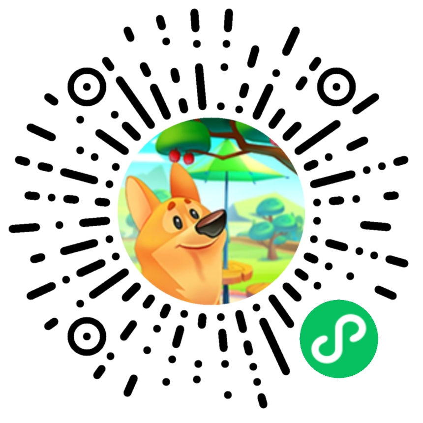
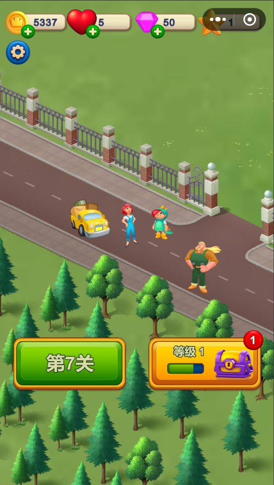
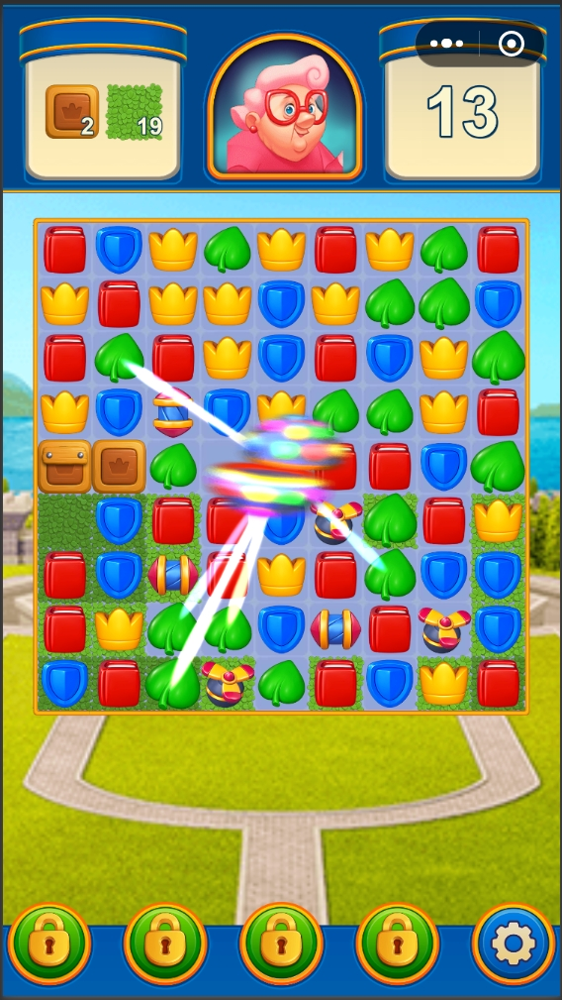

## Royal Match 三消游戏源码 

1. 一款当下最流行的及时消除三消游戏，核心玩法和关卡配置复刻 RolyalMatch。 
2. 游戏包大小:20MB
3. 关卡数：200关，内含关卡编辑器，可以自行添加关卡数据。
4. 开发引擎：CocosCreator3.8.3
5. 开发语言：TypeScript -->

 ### 联系作者
1. wx:1211686618
2. qq:1211686618

### 换皮版体验

[体验地址](https://www.sarsgame.com/game/royalmatch2/)

### 农场版体验方式：      
微信小游戏搜索《我的浪漫家园》

### 农场版游戏视频
[游戏视频](https://www.bilibili.com/video/BV1gkU5YHELW/?vd_source=3f0b411d925365a08cc23fd74f75b3c9) -->

 ### 声明
1. 购买后代码可以商用。
2. 农场版美术资源来源于网络，仅用于实现游戏功能，不建议商用。
3. 本产品为付费虚拟商品，一经购买成功概不退款，请支付前谨慎确认购买内容。
4. 项目最终解释权归作者所有，代码不可转售。

 ### 可提供的服务
1. 免费提供微信小游戏代码授权服务一次（提供购买订单截图）
2. 免费提供一周的换皮和修改需求服务：
3. 有偿提供上架各种平台服务：

### 有偿服务收费标准   
基本收费标准为800元/天，工作时长为8小时。   

### 购买链接
1. [Cocos引擎官方商城]()：官方提供代码验收服务，后期可以免费更新维护（未上架）
2. [作者微店商城](https://weidian.com/item.html?itemID=7321721621):商店提供除Cocos引擎外，使用其他引擎制作的商品（如Laya，Egret等）。后期免费更新但是要加入作者的QQ群，因为微店不提供更新服务。 

### 使用的工具   

1. [跨多平台的sdk框架](https://gitee.com/lecoolgamesdk/sdk)
2. [数据表导出工具](https://gitee.com/lecoolgame_framework/sarsgamexlsxparser)

 ### 产品介绍
1. [项目目录介绍](./docs/项目介绍.md)  
2. [代码目录介绍](./docs/代码目录.md)  
3. [添加新道具说明](./docs/添加新道具.md)
4. [换皮说明](./docs/换皮说明.md)
5. [地图编辑器](./docs/地图编辑器.md)  
6. [关卡编辑器](./docs/关卡编辑器.md)  
7. [三消内容介绍](./docs/三消内容介绍.md)
8. [数据表介绍](./docs/数据表介绍.md) 

  
### 功能开发完成情况

| 功能                   | 开发情况 | 说明                                             |
| ---------------------- | -------- | ------------------------------------------------ |
| 连胜奖励（2025-01-09）  | 已实现   |  连续胜利三次奖励特殊道具数量分别是2、3、4.失败一次清零 |
| 三个消除               | 已实现   |                                                  |
| 四个消除               | 已实现   | 产生导弹                                         |
| 五个消除               | 已实现   | 产生彩色球                                       |
| T字形                  | 已实现   | 产生火药桶                                       |
| L字形                  | 已实现   | 产生火药桶                                       |
| 田字形                 | 已实现   | 产生螺旋桨                                       |
| 地图根据内容大小适配   | 已实现   | 长屏幕的手机底部会展示banner广告                 |
| 根据内容绘制地图边缘框 | 已实现   | 游戏中包围道具的边缘框是自动生成的               |
| 游戏的胜利失败         | 已实现   |                                                  |
| 地图缩放               | 已实现   |                                                  |
| 钻石                   | 已实现   | 用于购买游戏中其他道具                           |
| 体力                   | 已实现   | 用于进入游戏                                     |
| 金币                   | 已实现   | 用于游戏中的复活。                               |
| 星星                   | 已实现   | 用于建造装饰物。                                 |
| 按需加载资源           | 已实现   |                                                  |
| 工具锤子               | 已实现   | 消除制定道具                                     |
| 工具弓箭               | 已实现   | 消除一行道具                                     |
| 工具炮筒               | 已实现   | 消除一列道具                                     |
| 工具小丑帽子           | 已实现   | 打乱道具后消除                                   |
| 音频系统               | 已实现   |                                                  |
| 设置音效开关           | 已实现   |                                                  |
| 设置音乐开关           | 已实现   |                                                  |
| 设置震动开关           | 已实现   |                                                  |
| 设置返回大厅           | 已实现   |                                                  |
| 数据存档               | 已实现   |                                                  |
| 教学引导               | 已实现   |                                                  |
| 内存清理               | 已实现   | 防止内存问题体造成游戏闪退                       |
| 模块分包               | 已实现   |                                                  |
| 特殊道具的获取和使用   | 已实现   |                                                  |
| 每日分享               | 已实现   | 根据分享次数获得特殊道具                         |
| 商城                   | 已实现   | 购买体力，特殊道具，金币                         |
| 微信平台支持           | 已实现   | 激励视频，banner，原生模版中的格子广告，插屏广告 |
| 建筑物选择             | 已实现   | 目前建筑数量245个。                              | 

 ### 游戏效果图
    
 

