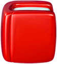
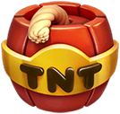
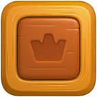

### 消除游戏

#### 三消游戏思路

1. 首先判断交换的道具是否为特殊道具，如果是则执行特殊道具的对应事件。
2. 判断是否是普通道具连成的形状。
3. 如果是：道具移动过来，进行对应的事件
4. 如果不是，道具移动后返回。
5. 消除道具
6. 道具的下落部位后，所有道具都要检查一遍。此时最麻烦
7. 重复执行上面的操作。
8. 当有道具被消除后。开始判断下落。

#### 节奏重新调整。非整体下落后判断消除。
1.  当有道具消除后。遍历所有道具，看看能否下落（包括斜落）
2.  下落的时候将自己的位置置null，
3.  到达要下落的位置后，设置当前位置 ，判断是否有可消除的情况，如果有，立即设置自己的位置为null，以免被其他检查使用。就做动画或者展示效果消除自己。
4.  如果没有继续判断是否可以下落。
5.  所以整个过程都不需要停顿。
6.  触发操作的道具必须要设置为used，否则会继续下落。
7.  触发操作的道具只有在操作完成后才能setCellNull,否则又可能被正在下落的道具继续下落。
#### 功能

### 道具消除时障碍物和草的规则
|          | 草                             | 障碍物                           | 普通道具 |
| -------- | ------------------------------ | -------------------------------- | -------- |
| 普通消除 | 下方                           | 周围                             | 无       |
| 导弹     | 消除路径中的草                 | 是                               |          |
| 螺旋桨   | 消除周围四个道具，并飞向一个草 | 消除周围四个道具，并飞向一个障碍 |          |
| 火药桶   | 是                             | 是                               | 是       |
| 灯球     |                                | 普通道具爆炸后消除障碍           | 是       |

## 道具介绍
| 道具                                                        | 说明                                                                |
| ----------------------------------------------------------- | ------------------------------------------------------------------- |
|            | 普通道具                                                            |
|          | 普通道具                                                            |
|            | 普通道具                                                            |
|           | 普通道具                                                            |
|             | 普通道具                                                            |
|                 | 消除一列   ,一行四个普通道具消除时生成                              |
|               | 消除一行  ,一列四个普通道具消除时生成                               |  |
|                  | 消除四周的道具并随随机飞向一个消除的道具 ，田字行普通道具消除时产生 |
|  | 消除周围两个格子的道具                                              |
|           | 随机消除所有相同道具或产生与之交换的道具并执行消除操作              |
|        | 消除后获得金币                                                      |
|            | 移动到最下面的位置消消除                                            |
|             | 旁边的普通道具被消除时消除                                          |
|       | 旁边相同颜色的普通道具被消除时消除                                  |
