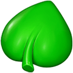

## 消除游戏介绍

### 道具消除时障碍物和草的规则
|          | 草                             | 障碍物                           | 普通道具 |
| -------- | ------------------------------ | -------------------------------- | -------- |
| 普通消除 | 下方                           | 周围                             | 无       |
| 导弹     | 消除路径中的草                 | 是                               |          |
| 螺旋桨   | 消除周围四个道具，并飞向一个草 | 消除周围四个道具，并飞向一个障碍 |          |
| 火药桶   | 是                             | 是                               | 是       |
| 灯球     |                                | 普通道具爆炸后消除障碍           | 是       |

## 道具介绍
| 道具                                                        | 说明                                                                |
| ----------------------------------------------------------- | ------------------------------------------------------------------- |
|            | 普通道具                                                            |
|          | 普通道具                                                            |
|            | 普通道具                                                            |
|           | 普通道具                                                            |
|             | 普通道具                                                            |
|                 | 消除一列   ,一行四个普通道具消除时生成                              |
|               | 消除一行  ,一列四个普通道具消除时生成                               |  |
|                  | 消除四周的道具并随随机飞向一个消除的道具 ，田字行普通道具消除时产生 |
|  | 消除周围两个格子的道具                                              |
|           | 随机消除所有相同道具或产生与之交换的道具并执行消除操作              |
|        | 消除后获得金币                                                      |
|            | 移动到最下面的位置消消除                                            |
|             | 旁边的普通道具被消除时消除                                          |
|       | 旁边相同颜色的普通道具被消除时消除                                  |
