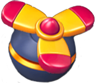

## 消除游戏介绍

### 工具介绍
| 工具                                         | 说明                       |
| -------------------------------------------- | -------------------------- |
|      | 消除一个指定一个道具       |
|       | 消除指定的一行的道具       |
|      | 消除指定的一列的道         |
|  | 重洗道具并消除和消除的道具 |

### 道具介绍
| 道具                                                          | 说明                                                                |
| ------------------------------------------------------------- | ------------------------------------------------------------------- |
|              | 普通道具                                                            |
|            | 普通道具                                                            |
|              | 普通道具                                                            |
|             | 普通道具                                                            |
|               | 普通道具                                                            |
|                   | 消除一列   ,一行四个普通道具消除时生成                              |
|                 | 消除一行  ,一列四个普通道具消除时生成                               |  |
|                    | 消除四周的道具并随随机飞向一个消除的道具 ，田字行普通道具消除时产生 |
|    | 消除周围两个格子的道具                                              |
|             | 随机消除所有相同道具或产生与之交换的道具并执行消除操作              |
|          | 消除后获得金币                                                      |
|              | 移动到最下面的位置消消除                                            |
|               | 旁边的普通道具被消除时消除                                          |
|               | 旁边的普通道具被消除时消除                                          |
|               | 旁边的普通道具被消除时消除                                          |
|               | 旁边的普通道具被消除时消除                                          |
|     | 旁边相同颜色的普通道具被消除时消除                                  |
|          | 消除后产生，占据四个格子草                                          |
|  | 旁边的普通道具被消除时消 ，占据四个格子                             |
|                 | 旁边的普通道具被消除时消，可上下移动                                |
|                           | 旁边的普通道具被消除时飞出信封消                                    |
|             | 旁边的普通道具被消除时消                                            |
|          | 只能被特殊道具消，占据四个格子除                                    |
|      | 旁边相同颜色的普通道具被消除时消除 ，占用四个格子                   |
|             | 只能被特殊道具消除，可以向下移动。                                  |
|  | 只能被特殊道具消除，固定不动                                        |
|     | 上层道具被消除时消除，需要消除两次                                  |
|    | 上层道具被消除时消除                                                |
|      | 旁边的普通道具被消除时消                                            |
|         | 旁边的普通道具被消除时消 ，占据横向或者纵向多个格子                 |

                                                                   