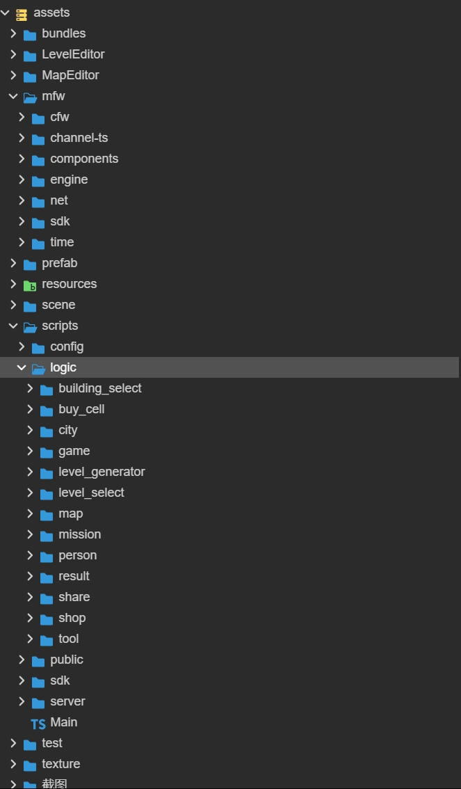

### 代码目录介绍  

  
  
- mfw
  - cfw：与引擎无关的框架代码
  - channel-ts:根据不同渠道区分逻辑的代码
  - components：与引擎相关的组件代码
  - engine:引擎基础文件，与cfw配套使用
  - net：网络框架，目前用于访问本地代码，
  - sdk:sdk框架代码
  - time：与时间相关的代码。
- scripts
  - config
    - Config.ts 
    - EnumDefine.ts：由数据表生成的枚举文件
    - GameDefine.ts：游戏中定义的配置文件
    - GlobalData.ts：游戏中使用的全局数据
    - JsonDefine.ts：数据表导出的数据表名字
    - NormalDefine.ts：基本不需要修改的配置数据
    - SDKData.ts: sdk使用的平台配置数据，包括广告id，分享，录屏等信息。
  - logic
    - building_select:建筑选择
    - buy_cell：购买特殊道具
    - city：城市地图
    - game：游戏
      - actions：游戏中各种形状的消除逻辑
      - checker：游戏检查匹配各种形状
      - controller：游戏逻辑控制
      - creator：游戏道具生成管理
      - drop：游戏掉落方式
      - finder：游戏中查找各种形状类
      - model：游戏模型
      - objects：游戏对象
      - state：状态机
      - tool：工具
      - ui：ui相关
      - view:显示相关
    - level_select：关卡选择
    - map：地图
    - mission：任务
    - person：角色
    - result：游戏结算
    - share：分享
    - shop：商城
    - tool：工具
    - 
  - public：公用功能类。
    - agreement
    - 
  - sdk：sdk相关的组件。
  - server：本地存档。因为模拟的是远程调用方式，所以可以将逻辑搬运到服务器。