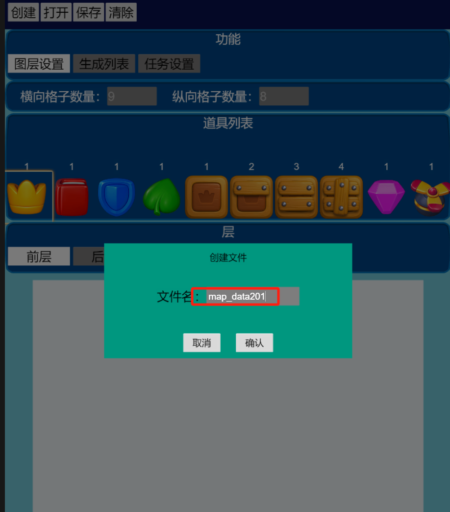
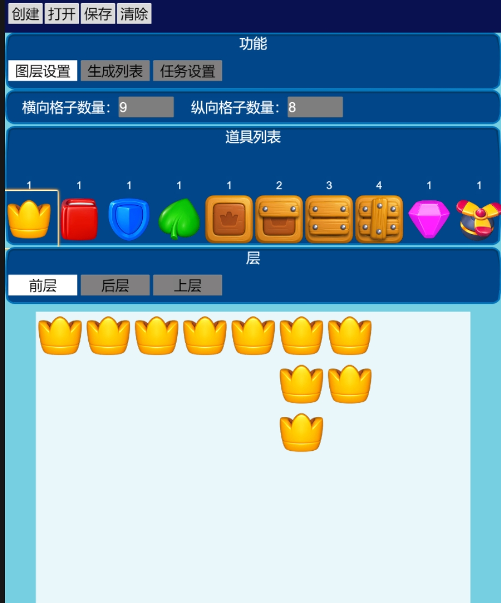
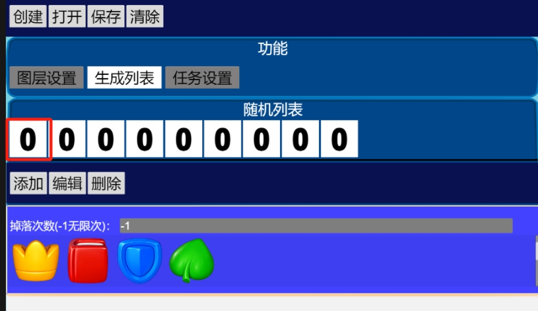
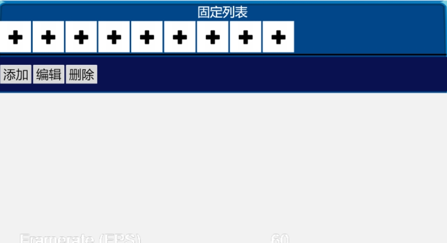
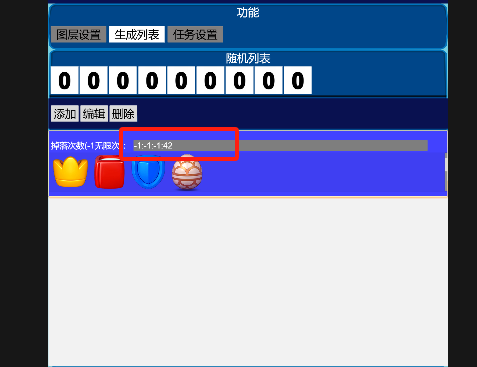
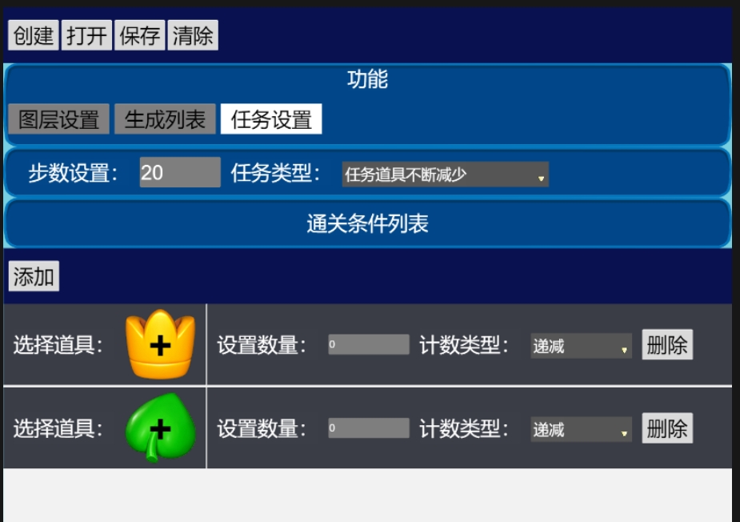

## 关卡编辑器使用说明
1. 运行editor场景文件
2. 创建按钮：点击创建按钮，弹出创建文件对话框，在对话框中输入map_dataxxx,xxx代表关卡数量，从1 开始。   
   
3. 打开按钮：点击打开按钮，加载现有的关卡文件。（只有在创建或者打开文件之后才能正常操作编辑器）
4. 输入格子的横向和纵向的数量
5. 选择需要设置的消除道具，然后在空白的场景中拖拽或者点击，设置场景中的初始道具。
6. 设置道具分别分为前层：也就是主要的消除层，厚层：放置草等道具。上层，放置一个障碍道具。选择不同的层，界面中会显示出对应可操作的道具。
     
7. 调整生成列表：也就是道具在消除后的创建队列。分为随机创建和固定创建两种。游戏中设置了多少列，就会有多少个索引选项 ,全是0 ，代表每一列选择的都是第一个生成项。 
      
8. 有些关卡掉落的道具都是一定的，所以这时候需要使用固定列表。  
     
9.  掉落次数是对应每个道具的，如果所有道具都是掉落无限次数，就写一个-1即可，如果有些道具有固定的掉落数量就必须写成-1,10,-1,-1这种形式。也就是每个道具都有对应的数量。可以参考124关和180关数据
     
10. 任务设置：  
     
首先要添加任务道具，也就是通过的条件，比如消除某个道具多少个。有些关卡是消除多个道具后胜利，有些关卡没有失败条件，步数使用完就胜利，比如金币关卡。

11.  所有数据都设置完毕后，点击保存按钮，然后将浏览器下载的数据放到bundles/map_data/map目录下即可。

## 关卡编辑器说明  
1. 编辑器目前已经可以直接预览编辑后的数据了。
2. 关卡中的盘面的各种外形是如何设置的？
根据道具摆放情况自动生成的。并没有设置的地方。
3. 编辑器是否具有难度评价能力？
不具备关卡难易度评价能力，目前也没有对导出的数据做过多的检查。
4. 关卡编辑器中显示的道具，为什么有些看着样子是一样的？
道具的图片一样，但是由于显示的数字是不一样的。也就代表占用的格子数量不同。所以并不是一样的道具。放到盘面上时会显示出应有的样子。
5. 是不是没办法控制掉落入口，掉落入口一定是那排最上面的砖块？
目前掉落入口都是程序自己寻找的，编辑器并不支持设置入口位置。
6. 两个分开的区块是不是没办法分别使用掉入口，一定是从上往下掉？
是的，这个问题和问题5是一个道理。一定是从上往下掉

