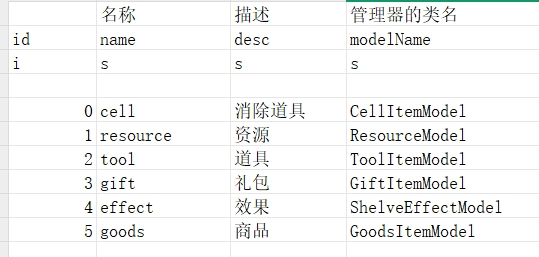
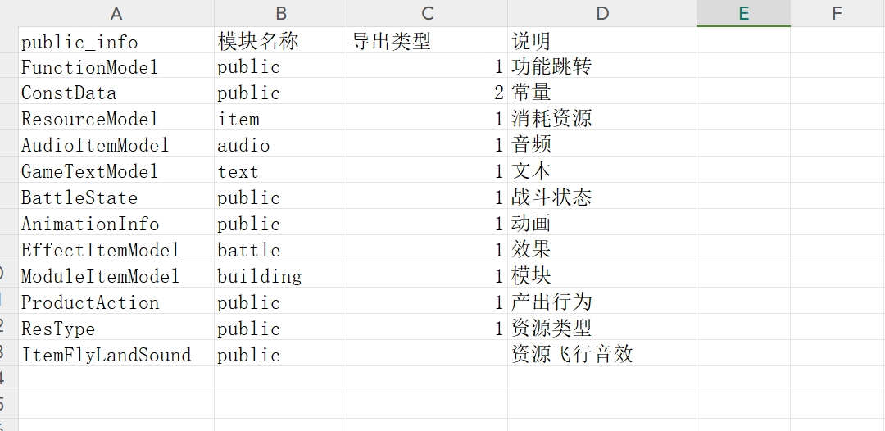
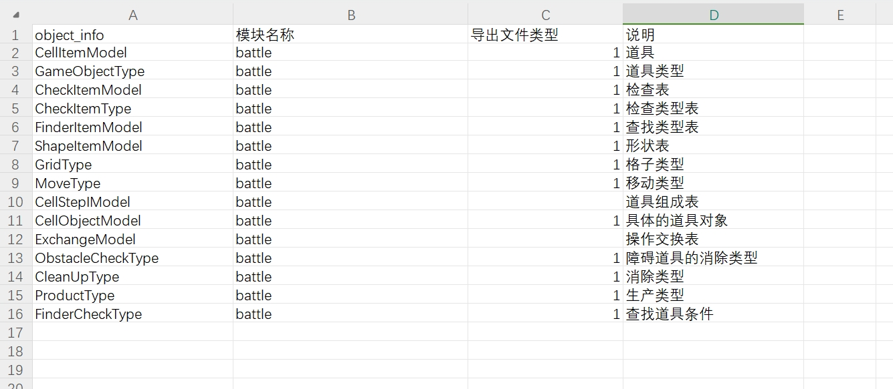
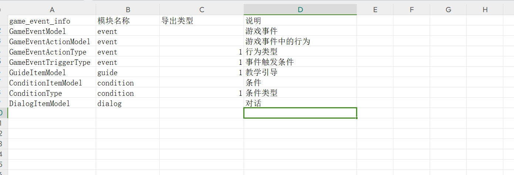

## 数据表介绍

1. GameEnum.xlsx：资源类型表
- 资源通过id分类：道具ID = 类型+id；比如1是一类 那么1001，就是某个道具的id。用Math.floor(id/1000)得到的1就是此道具的类型。详见：《GameEnum.xlsx》中的ResourceType表

2. Public.xlsx：   

3. 道具状态.xlsx：道具状态、道具各个状态需要的动画和效果、道具对象的状态
4. 工具.xlsx：工具相关数据
5. 关卡.xlsx：关卡相关数据
6. 活动.xlsx：分享相关数据
7. 建筑.xlsx：建筑的开启等相关数据
8. 角色.xlsx：角色相关数据
9.  逻辑事件.xlsx：道具消除时的行为数据
10. 商店表.xlsx：商店数据
11. 游戏对象表.xlsx ：道具、道具阶段、道具对象、查找、检查等相关数据。

12. 游戏事件.xlsx   
