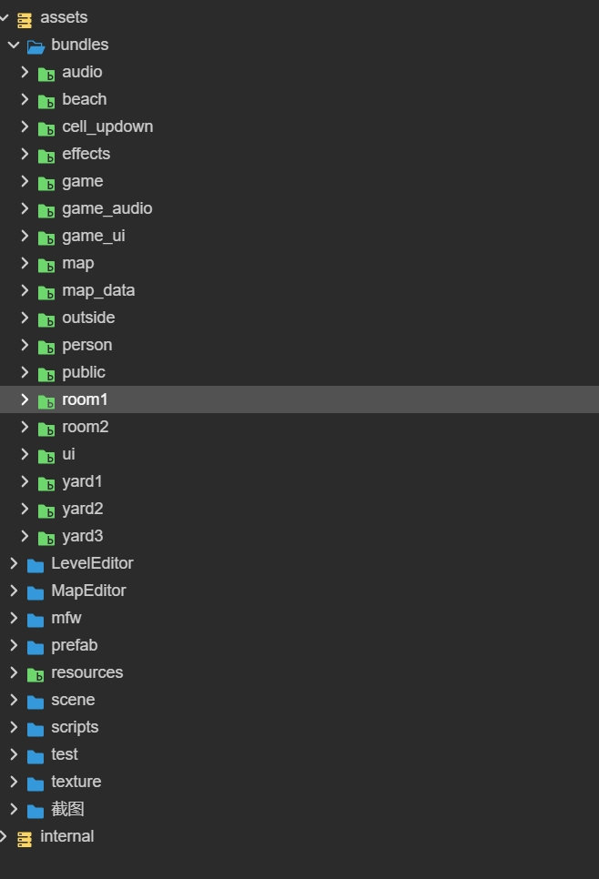

### 项目目录介绍

  

- assets
  - bundles：所有bundle存放在这个目录下
    - audio：游戏中公用音频
    - beach：地图海滩资源
    - cell_updown：游戏关卡中的上下层使用的道具
    - effects：游戏关卡中使用的效果
    - game：游戏关卡主要资源
    - game_audio：游戏关卡中使用的音频
    - game_ui：游戏关卡中使用的ui
    - map：地图主要资源
    - map_data：关卡数据
    - outside：地图户外部分资源
    - person：人物相关资源
    - public：游戏公用图标等
    - room1：地图房间1
    - room2：地图房间2
    - ui：游戏中的ui
    - yard1：地图院子1
    - yard2：地图院子2
    - yard3：地图院子3
  - LevelEditor: 关卡编辑器相关内容
  - MapEditor：地图编辑器相关内容
  - mfw：项目中使用的相对独立的代码库
  - prefab：无需动态加载的预制体
  - resources：引擎提供，动态资源存放目录
    - agreement：隐私协议
    - big_map:大地图数据
    - data:游戏数据表中导出的数据
    - prefab：常驻游戏中和启动后需要的预制体
  - scene:场景文件
  - scripts: [游戏中的源代码](./代码目录.md)
  - texture：游戏ui中使用的静态图片资源
  - 截图：因为移除这个目录3.8.3会出问题，所有保留
- data：游戏中用到的数据表
- build-templates：引擎提供的构建后自动拷贝的文件
- d.ts：游戏中声明的类型文件。